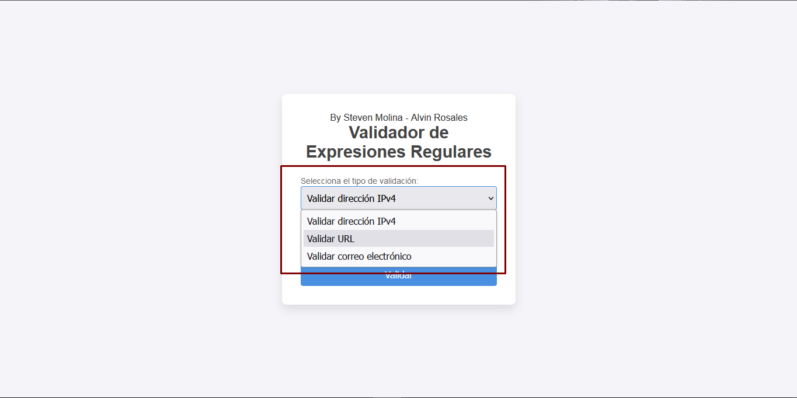
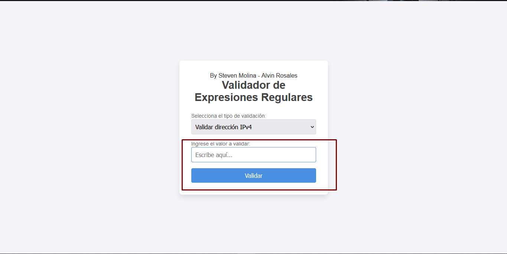
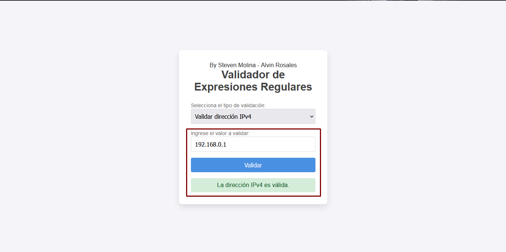

# Guía de Uso

## Descripción
Este proyecto es una herramienta para validar direcciones IPv4, URLs y correos electrónicos usando expresiones regulares. La interfaz es sencilla, permitiendo a los usuarios elegir el tipo de validación y mostrar los resultados en tiempo real.

## Instalación
1. Clona el repositorio en tu máquina local:
   https://github.com/AlvinRHD/regex-validator.git

2. Navega a la carpeta del proyecto:
   cd regex-validator

3. Abre el archivo index.html en tu navegador web.

## Uso
Selecciona el tipo de validación que deseas realizar del menú desplegable:

    • IPv4: Para validar direcciones IP.
    • URL: Para validar direcciones web.
    • Email: Para validar direcciones de correo electrónico.

1. Ingresa el valor que deseas validar en el campo de texto.

3. Haz clic en el botón "Validar".
  
5. Recibirás un mensaje que indica si el valor ingresado es válido o inválido. El mensaje se mostrará en color verde para valores válidos y en rojo para valores inválidos.

## Puedes probar el regex validator con estos ejemplos u otros que tú tengas.

    Dirección IPv4 válida: 192.168.0.1
    Dirección IPv4 inválida: 999.999.999.999
    URL válida: https://www.google.com
    URL inválida: htp://invalid-url
    Correo electrónico válido: ejemplo@correo.com
    Correo electrónico inválido: ejemplo@correo
